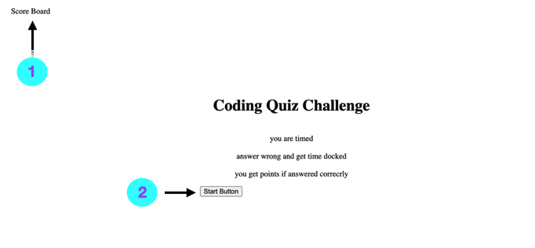
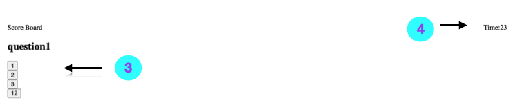
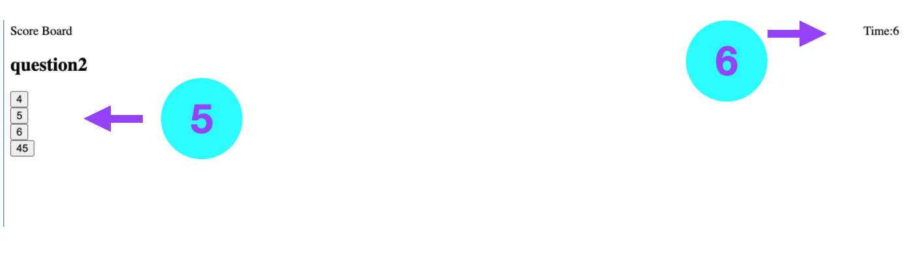
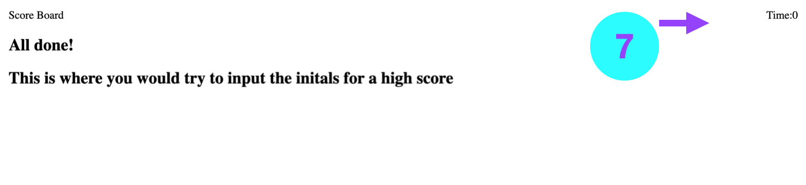

#  Coding Quiz


Deployed Link: [https://cortezstephanie.github.io/Coding-Quiz-JS/](https://cortezstephanie.github.io/Coding-Quiz-JS/)
##  A timed quiz on JavaScript fundamentals that stores high scores.
### Table of contents
- [Installation](#installation)
- [Usage](#usage)
- [Contributors](#contributors)
- [License](#license)
### Installation
```npm i``` then open in default browser
### Usage
<br>
1. Here you will have a link to view scores
<br>
2. Press the Start button to start game


3. You are presented with a question 
<br>
4. The timer will begin once you start the game

<br>
5. Once you answer your first question another one will appear
<br>
6. answer wrong and you lose time on the timer

<br>
7. When the time is up you are designated to the score board to put your initials.
## License
This repository is covered by the MIT License  <br> 
https://opensource.org/licenses/MIT
#### Contributors
My Tutor Andres Long
#### Test Instructions
none
##### Questions
If there are any questions please contact me on my GitHub: [CortezStephanie](https://github.com/CortezStephanie)
